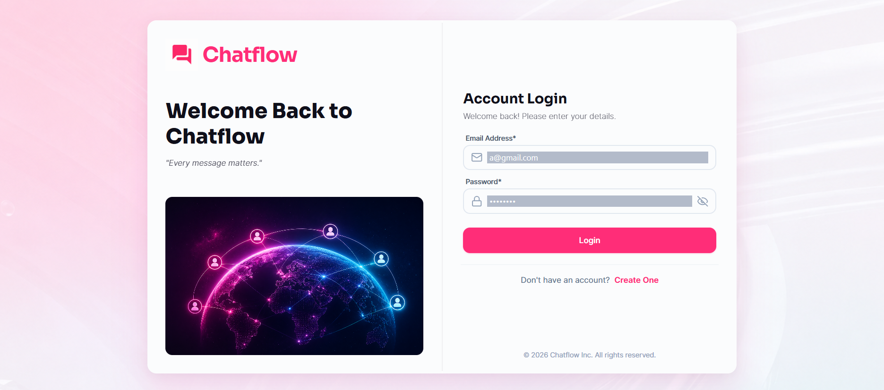
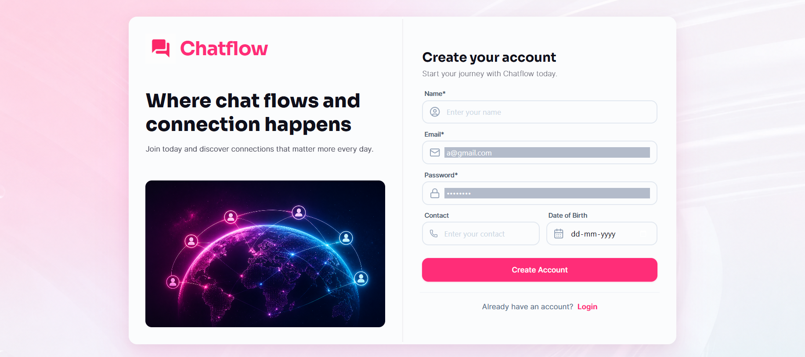
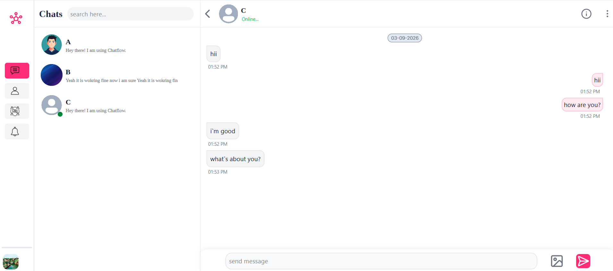

# 💬 Real-Time Chat Application

A modern **full-stack real-time chat application** built with **React, Node.js, Express, Socket.IO, and MongoDB**.

The application allows users to communicate instantly with each other through real-time messaging, while providing a smooth and responsive user experience.

---

## 🚀 Features

* 🔐 User Authentication
* 💬 Real-time messaging using Socket.IO
* 🟢 Online/Offline user status
* 📱 Responsive user interface
* ⚡ Instant message delivery
* 💾 Persistent message storage

---

## 🛠️ Tech Stack

### Frontend

* React
* JavaScript
* HTML
* CSS
* Tailwind CSS 
* Axios

### Backend

* Node.js
* Express.js
* Socket.IO

### Database
* MongoDB

---

## 📂 Project Structure

```text
Chat-Application/
│
├── Backend/
│   ├── src/
│   │   ├── Database/
│   │   ├── controller/
│   │   ├── emails/
│   │   ├── middleware/
│   │   ├── models/
│   │   ├── routes/
│   │   ├── utils/
│   │   ├── ENV.js
│   │   ├── app.js
│   │   └── socket.js
│   │
│   ├── index.js
│   ├── package.json
│   └── package-lock.json
│
├── Frontend/
│   ├── public/
│   │
│   ├── src/
│   │   ├── components/
│   │   ├── hooks/
│   │   ├── lib/
│   │   ├── pages/
│   │   ├── socket/
│   │   ├── store/
│   │   ├── utils/
│   │   ├── App.css
│   │   ├── App.jsx
│   │   └── main.jsx
│   │
│   ├── .gitignore
│   ├── README.md
│   ├── eslint.config.js
│   ├── index.html
│   ├── package.json
│   ├── package-lock.json
│   ├── vercel.json
│   └── vite.config.js
│
└── .gitignore
```
---

<!-- --- -->

## 🔌 Real-Time Communication

This project uses **Socket.IO** for real-time communication between users.

### Basic Flow

```text
User sends a message
        │
        ▼
Frontend emits Socket event
        │
        ▼
Socket.IO Server receives event
        │
        ▼
Message is processed and stored
        │
        ▼
Server emits message to receiver
        │
        ▼
Receiver gets the message instantly
```

---

<!-- ## 🌐 API Overview

### Authentication

```text
POST   /api/auth/signup
POST   /api/auth/login
POST   /api/auth/logout
```

### Messages

```text
GET    /api/messages/:userId
POST   /api/messages/send/:userId
```

--- -->

## 🧠 Key Concepts Used

* REST APIs
* JWT Authentication
* Real-Time Communication
* WebSockets
* Socket.IO
* React State Management
* MongoDB Database Design
* Client-Server Architecture
* Middleware
* Environment Variables

---

## 📸 Screenshots


### Login page


### Signup page


### Chat page



---

<!-- ## 🔮 Future Improvements

* [ ] Typing indicators
* [ ] Message reactions
* [ ] Image and file sharing
* [ ] Push notifications
* [ ] Message deletion
* [ ] Read receipts
* [ ] User profiles
* [ ] Dark/Light mode
* [ ] Video and voice calling using WebRTC

--- -->

## 🤝 Contributing

Contributions are welcome!

1. Fork the repository
2. Create a new branch

```bash
git checkout -b feature/your-feature-name
```

3. Make your changes
4. Commit your changes

```bash
git commit -m "Add your feature"
```

5. Push to GitHub

```bash
git push origin feature/your-feature-name
```

6. Create a Pull Request

---

## 👨‍💻 Author

**Ankit Dhakad**

🔗 **LinkedIn:** [ankitdhakad4](https://www.linkedin.com/in/ankitdhakad4)

🌐 **Portfolio:** [Visit My Portfolio](https://ankitdhakad4.github.io/ankit-portfolio/)

🚀 **Live Project:** [Live Demo](https://chatflow-theta-eight.vercel.app/)


⭐ If you like this project, consider giving it a star!

---

## 📄 License

This project is created for learning and portfolio purposes.

